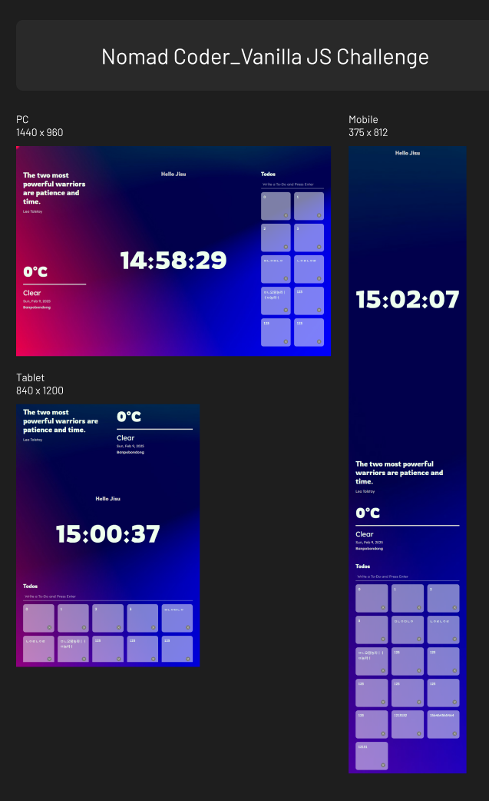

# Nomad Coder - Vanilla JS Challenge

This is a solution to the [Vanilla JS Challenge](https://nomadcoders.co/).

## Table of contents

- [Overview](#overview)
  - [Screenshot](#screenshot)
  - [Links](#links)
- [What I've done](#whati'vedone)

## Overview

### Screenshot

### Links

- Solution URL: [https://github.com/zeegu/]
- Live Site URL: [https://zeegu.github.io/]

## What I've done

- A real-time clock
- Log in using local storage
- To Do List with Local Storage
- Random background image
- Weather and location
- Responsive Layout for Desktop/Table/Mobile
